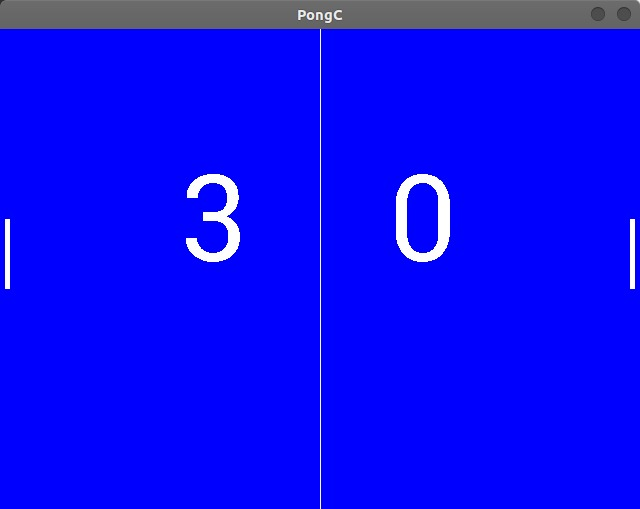

# PongC 🎮
Equipe: 
Leonardo Cunha Luna Freire, 23148764 
Lukas de Sousa Figueirêdo, 23724501 
Bruno Rodrigues dos Santos, 23046317

 

   

---

# :pushpin: Sumário

* [Sobre]
* [Iniciando]
* [Relatório]

# :closed_book: Sobre

- Projeto de conclusão da disciplina de Técnicas de Desenvolvimento de Algoritmos; 
- Ministrada pelo Prof. Leandro Figueiredo Alves;

- Objetivo do projeto: criar um clone do jogo Pong, usando a linguagem C com a biblioteca SDL2.

# 📋 Relatório

   - Relatório do projeto: <a href="https://github.com/leonardoclf/pongC/blob/master/relatorio.pdf">Link</a>

# :rocket: Iniciando

Abra o terminal e execute *``./pongc``*.
